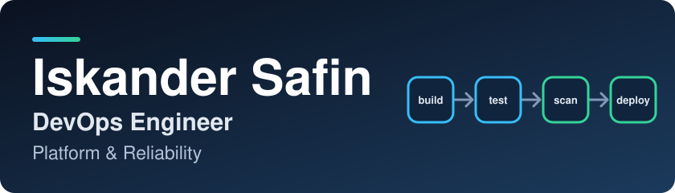

  

  <b><i>Reviewed infrastructure. Boring pipelines. Secrets nobody pastes in chat.</i></b> 
  Kazan · UTC+3 · fully remote

  
  

> [!NOTE]
> **Open to remote DevOps / Platform / SRE roles with international teams.** Message me on Telegram or by email.

## About

I build the platform that product teams ship on: infrastructure that is reviewed and repeatable, pipelines that are boring in the best way, and secrets that never travel through chat. 5+ years in IT infrastructure, 3+ of them in DevOps. At *Smart Horizon* I run hybrid infrastructure (OpenStack, VK Cloud, Yandex Cloud) for several microfinance products; at Sber I rebuilt release pipelines. I mentor junior engineers and run technical interviews.

## Impact

<table>
  <tr>
    <td align="center" valign="top" width="50%"><h3>14 → 3–4 days</h3>release delivery time CI/CD rebuilt for 2 teams · Sber</td>
    <td align="center" valign="top" width="50%"><h3>90%</h3>of deployments automated GitLab CI/CD + Ansible · onboarding in 1–2 days</td>
  </tr>
  <tr>
    <td align="center" valign="top"><h3>1000+ credentials</h3>moved to Vault for 10+ teams custom RBAC and secret engines</td>
    <td align="center" valign="top"><h3>50+ developers</h3>on a least-privilege model access control that did not exist before</td>
  </tr>
  <tr>
    <td align="center" valign="top"><h3>4 environments</h3>across 3 products, one Terraform solution every change through a merge request</td>
    <td align="center" valign="top"><h3>700 hosts</h3>monitored in one place Zabbix/Glaber + Grafana · logs via Kafka → OpenSearch</td>
  </tr>
</table>

## Selected work

Reference implementations of patterns from my DevOps work, rebuilt from scratch on **synthetic data** (no employer code or data). Each README ends with what was verified and what was not.

**[pipeline-platform](https://github.com/ftonita/pipeline-platform)** &nbsp; 
One `.platform.yml` replaces a whole CI config: JSON Schema validation, then a GitLab child pipeline with only the jobs that apply. Vault via `id_tokens`, SHA-tagged images in Nexus, deploy by Ansible, Helm or ArgoCD. 
GitLab CI · Vault · Nexus · Helm · ArgoCD · Python

**[vault-migration-toolkit](https://github.com/ftonita/vault-migration-toolkit)** &nbsp; 
Moves secrets from legacy storage into Vault safely: finds weak and reused ones, maps them to team and environment paths, applies with check-and-set, verifies. Never prints a value. Tested against a real Vault in CI. 
Vault KV v2 · Python · migration safety

**[access-as-code](https://github.com/ftonita/access-as-code)** &nbsp; 
Who may do what, as reviewed YAML. Eleven least-privilege lint rules; compiles to Vault policies, Kubernetes RBAC and GitLab members; detects drift. 
Vault · Kubernetes RBAC · GitLab · policy-as-code

**[release-bottleneck-analyzer](https://github.com/ftonita/release-bottleneck-analyzer)** &nbsp; 
Finds where lead time is really lost (review, merge or release queue), computes DORA-style metrics and estimates what a fix would save. 
DORA metrics · Python · zero runtime dependencies

**[opsbot](https://github.com/ftonita/opsbot)** &nbsp; 
A ChatOps Telegram bot for on-call: roles, rate limits, an audit trail and a two-person rule for production changes. 
aiogram · Alertmanager · security design

## Learning in public

**[devops-cursus](https://github.com/ftonita/devops-cursus)**: Russian-language DevOps manuals I write to refresh the fundamentals and to learn AI-assisted engineering.

- **Content:** four manuals so far (Git, CI/CD, Docker, Git workflow), three with self-check quizzes, plus a shared glossary. Next on the [roadmap](https://github.com/ftonita/devops-cursus/blob/main/ROADMAP.MD): Kubernetes, IaC, monitoring, DevSecOps, SRE.
- **How it is made:** a small multi-agent pipeline (researcher → writer → reviewer → quiz builder), each agent on the model tier that fits its job.
- **How it ships:** a [MkDocs site](https://ftonita.github.io/devops-cursus/) built and published by a GitHub Actions workflow that doubles as a worked example for the CI/CD lesson.

## How I work

- **Everything as code, reviewed in merge requests:** infrastructure, access and pipelines.
- **AI-assisted, test-gated:** I use AI assistants for drafts and review; tests and CI decide what ships.
- **Honest documentation:** every project states what was verified and what was not.

## Toolbox

<table>
  <tr>
    <td><b>IaC &amp; cloud</b></td>
    <td>    </td>
  </tr>
  <tr>
    <td><b>CI/CD &amp; GitOps</b></td>
    <td>    </td>
  </tr>
  <tr>
    <td><b>Containers</b></td>
    <td>    </td>
  </tr>
  <tr>
    <td><b>Security &amp; observability</b></td>
    <td>   </td>
  </tr>
  <tr>
    <td><b>Data, code &amp; OS</b></td>
    <td>    </td>
  </tr>
</table>

Also: Patroni, Redis Sentinel, Keepalived, MySQL tuning, VictoriaMetrics, Filebeat, Kafka, OpenSearch, Nginx, Django/DRF, aiogram.

## Education and achievements

- **School 21** (Ecole 42 curriculum), Kazan: Software Engineering, alumnus 2024; volunteer mentor for new participants.
- **Languages:** Russian (native), English B2 with working proficiency in technical communication.
- Hackathons: 🥇 Stackers New Year web hackathon (DevOps, backend) · 🥈 School 21 Data Science (team lead) · 🥉 Roseltorg.

<b>Older projects: Python, web and systems programming</b>

- [PassBot](https://github.com/ftonita/PassBot): pass-control Telegram bot with a web interface, containerised with Docker Compose.
- [MicroShop](https://github.com/ftonita/MicroShop_on_Django) · [Simple Blog](https://github.com/ftonita/Simple_Blog_on_Django): Django / DRF applications (Stripe, sessions, accounts).
- [Inception](https://github.com/ftonita/Inception): WordPress stack on a VM with Docker Compose and Make only.
- [NetPractice](https://github.com/ftonita/NetPractice) · [born2beroot](https://github.com/ftonita/born2beroot): networking and Linux hardening.
- C / C++ foundations from the 42 curriculum: [libft](https://github.com/ftonita/libft), [minishell](https://github.com/ftonita/minishell), [Philosophers](https://github.com/ftonita/Philosophers), [CPP Modules](https://github.com/ftonita/CPP).

  Let's talk: <a href="https://t.me/ftonita">Telegram @ftonita</a> · <a href="mailto:farmtonita@gmail.com">farmtonita@gmail.com</a>

