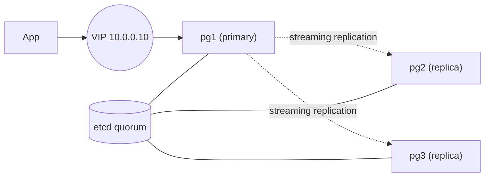

# ansible-ha-databases

[](https://github.com/ftonita/ansible-ha-databases/actions)


Ansible roles for highly available data stores with **automatic failover**:

- **PostgreSQL**: etcd (DCS) + Patroni + Keepalived. A virtual IP always follows the current primary, so applications use one stable address.
- **Redis**: replication + Sentinel with quorum.

> A sanitised version of the failover clusters I designed and run in production. No employer code or data.

## Architecture



Keepalived tracks `GET /primary` on the local Patroni REST API: only the leader holds the VIP, and it moves within seconds of a Patroni promotion.

## Usage

```bash
cp -r inventories/example inventories/prod        # edit hosts and group_vars
ansible-vault create inventories/prod/group_vars/vault.yml
# define: vault_patroni_superuser_password, vault_patroni_replication_password, vault_redis_password
ansible-playbook -i inventories/prod site.yml --check --diff   # dry run
ansible-playbook -i inventories/prod site.yml
```

## Design notes

- `serial: 1`: nodes are changed one at a time, the cluster never goes down for a config roll.
- `use_pg_rewind` + `maximum_lag_on_failover`: a stale replica is never promoted; a former primary rejoins without a full rebuild.
- Passwords are templated with `no_log`, files are `0640`, nothing secret is in Git.
- Lints clean with `ansible-lint` **production** profile (enforced in CI).

## Roadmap

- [ ] Molecule scenario (Docker) for converge + failover test
- [ ] pgBackRest backups and restore check
- [ ] Prometheus exporters and alert rules
