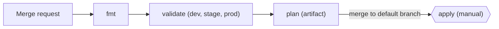

# terraform-hybrid-iac

[](https://github.com/ftonita/terraform-hybrid-iac/actions)


Multi-environment Infrastructure as Code for OpenStack-compatible clouds (OpenStack, VK Cloud) with a **merge-request-driven** GitLab pipeline: nothing reaches infrastructure without review, a plan and a manual approval.

> A sanitised reference implementation of the pattern I run in production (4 environments across 3 products on a hybrid OpenStack / VK Cloud / Yandex Cloud estate). No employer code or data.

## Why this layout

| Decision | Reason |
|---|---|
| One directory per environment (`environments/dev\|stage\|prod`) | Blast radius of a mistake is one state file; environments can drift on purpose, never by accident. |
| Small reusable modules (`network`, `compute`) | Same code, different inputs. A new product = a new `environments/` entry, not a copy-paste of resources. |
| Remote S3 state, one key per env | Works with Yandex Object Storage / VK Cloud S3; no state on laptops. |
| Default-deny security groups | `ingress_rules` is explicit; nothing is open unless it is in Git. |
| `plan` on every MR, `apply` manual + `resource_group` | Reviewers read the plan; only one apply per environment runs at a time. |

## Pipeline



## Quick start

```bash
export OS_AUTH_URL=... OS_USERNAME=... OS_PASSWORD=... OS_PROJECT_NAME=...   # or masked CI variables
export TF_STATE_BUCKET=my-state-bucket AWS_ACCESS_KEY_ID=... AWS_SECRET_ACCESS_KEY=...

make validate                 # offline: init -backend=false + validate for every env
make plan ENV=dev
```

Per-environment inputs live in `environments/<env>/` (`example.tfvars` shows the shape; real `*.tfvars` are git-ignored).

## Structure

```
modules/
  network/   network, subnet, router, router interface
  compute/   security group + rules, instances (for_each over a map)
environments/
  dev/ stage/ prod/   main.tf + backend.tf per environment
.gitlab-ci.yml        fmt -> validate -> plan -> manual apply
```

## Status & roadmap

- [x] Modules, three environments, MR pipeline
- [ ] `tflint` + `checkov` stages
- [ ] Yandex Cloud provider module alongside OpenStack
- [ ] Atlantis / `terraform-docs` integration
