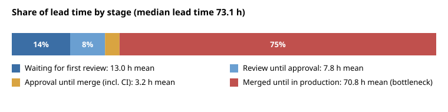
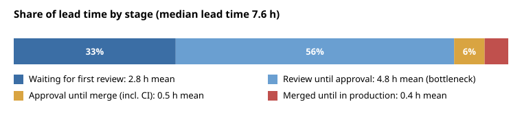

# release-bottleneck-analyzer

[](https://github.com/ftonita/release-bottleneck-analyzer/actions)


**Find out where the time between "merge request opened" and "running in production" is really spent, before optimising the wrong thing.**

Teams often speed up CI when the real delay is a weekly release train, or add reviewers when the delay is a queue after approval. This tool splits every change's lead time into stages, shows which stage dominates, computes DORA-style metrics, and estimates what fixing a stage would save.

> **Synthetic data only.** The bundled datasets are produced by a seeded generator (`release-analyzer demo`). Their numbers are properties of the generator, not measurements of any real organisation, and the before/after contrast is deliberately large to make the tool's output easy to read.



## What it measures

| Stage | From -> to |
|---|---|
| Waiting for first review | MR opened -> first review |
| Review until approval | first review -> approval |
| Approval until merge (incl. CI) | approval -> merge |
| Merged until in production | merge -> deployed to production |

Shares are computed from stage **means** so they add up to 100%; p50 and p90 are shown beside them because tails matter. On top of that: deployments per week, change failure rate, time to restore, changes per deployment, deploy-day concentration, per-team slowest stage, small-vs-large change lead time, CI duration.

## Quick start

```bash
pip install .
release-analyzer demo --out data                      # synthetic before/after datasets
release-analyzer analyze data/before.json --svg before.svg
release-analyzer compare data/before.json data/after.json
release-analyzer simulate data/before.json --stage release_wait --reduction 0.5
```

Use your own data with the same columns (JSON or CSV): `id, team, size, created_at, first_review_at, approved_at, merged_at, pipeline_seconds, deployed_at, release_id, failed, restored_at`. Timestamps are ISO 8601. Changes that are not deployed yet, or whose timestamps are out of order, are **excluded and listed** under "Data quality" instead of silently skewing results. `--working-hours --tz-offset 3` counts only Mon-Fri 09-18 so a weekend is not mistaken for a slow review.

## Example output (synthetic "before" dataset)

```text
Median lead time 73.1 h (p90 171.0 h, wall clock). Biggest bottleneck: Merged until in production = 75% of lead time.

| Waiting for first review        | 13.0 | 9.9 | 24.2 | 14% |
| Review until approval           |  7.8 | 6.4 | 12.0 |  8% |
| Approval until merge (incl. CI) |  3.2 | 2.8 |  5.5 |  3% |
| Merged until in production      | 70.8 | 50.9 | 152.2 | 75% |   <- bottleneck

R2. Shorten the release queue. 75% of lead time is spent between merge and production (releases are batched
(median 7 changes per deployment); 100% of deployments happen on Thursday). Cutting this stage by 50% would
save about 35.4 h of mean lead time.
```

`simulate` answers the "what if" directly: `mean lead time 94.9 h -> 59.5 h if 'release_wait' is cut by 50% (-37%)`. The estimate recomputes every change with that stage shortened; it assumes the other stages do not change in response, so treat it as a rough guide rather than a promise.

`compare` on the two synthetic datasets (after = deploy on merge, faster reviews):

| Metric | before | after | Change |
|---|--:|--:|--:|
| Lead time p50 (h) | 73.1 | 7.6 | -90% |
| Deployments per week | 1.0 | 9.2 | +776% |
| Change failure rate | 25% | 8% | -69% |



## Recommendation rules

Each rule has a threshold in `analysis.THRESHOLDS` and cites its evidence: R1 first-review wait >= 30% of lead time; R2 release queue >= 30% (mentions batching and deploy-day concentration when present); R3 approval-to-merge >= 25% (distinguishes slow CI from an idle queue); R4 review >= 30%; R5 large changes >= 2x slower than small ones; R6 change failure rate >= 15%; R7 median time to restore >= 24 h. They are heuristics to start a conversation, not verdicts.

## What is verified

Reproduce with `pip install -e ".[dev]" && pytest` (39 tests, 99% line coverage): hand-computed stage durations and DORA numbers on small fixtures, percentile and working-hours arithmetic (weekends, nights, time zones, clipping), data-quality exclusion, every recommendation rule firing and not firing, what-if math, report rendering (the SVG is parsed as XML), CLI flows and error exits.

**Not verified / limitations:** there is no connector yet for GitLab, GitHub or Jenkins exports, so data must be converted to the columns above; it has not been run on a real organisation's data; time-to-first-review ignores bot comments only if your export does; "failed" and "restored_at" must come from your incident or rollback records; statistics are descriptive, with no significance testing, and small samples (a few dozen changes) will be noisy.
